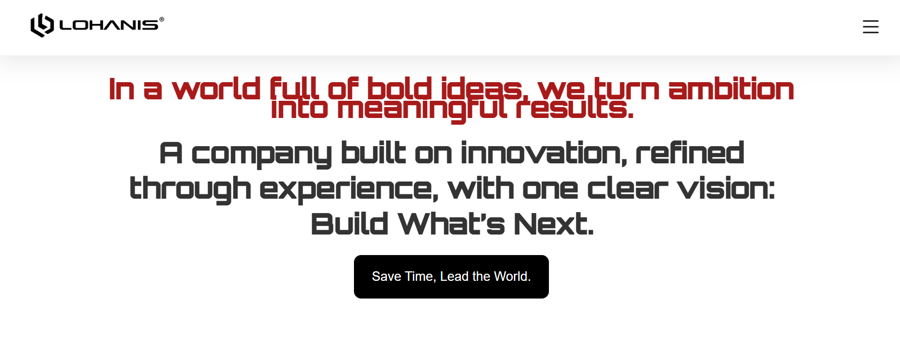

# Lohani Solutions — Software House Website

Lohani Solutions is my personal software house website and digital solutions brand.

The website is designed to present Lohani Solutions professionally, showcase its services and capabilities, and provide an online presence for future clients and businesses.

## 🖥️ Website Preview

<p align="center">
  
</p>

## 🚀 About Lohani Solutions

Lohani Solutions focuses on building modern digital products, software, and intelligent solutions.

### Services

* Web Development
* Software Solutions
* AI & Automation
* AI/ML Solutions
* Mobile App Development
* Custom Software Development
* Business Automation
* Digital Solutions

## 🛠️ Technologies

This project is currently being developed with:

* React.js
* JavaScript
* HTML5
* CSS3
* Vite

## ⚙️ Setup & Run

### 1. Clone the Repository

```bash
git clone <your-repository-url>
```

### 2. Navigate to the Project

```bash
cd Lohani-Solutions
```

### 3. Install Dependencies

```bash
npm install
```

### 4. Start the Development Server

```bash
npm run dev
```

### 5. Open in Browser

After starting the development server, Vite will provide a local URL, usually:

```text
http://localhost:5173
```

Open the URL in your browser to view the website.

## ✨ Features

* Modern software house landing page
* Professional navigation bar
* Services dropdown menus
* Technologies section
* Customer/business section
* Portfolio section
* About Us section
* Contact section
* Responsive user interface
* Modern and professional design

## 📂 Project Structure

```text
p-web-application/
├── node_modules/
├── src/
│   ├── assets/
│   ├── components/
│   ├── data/
│   ├── pages/
│   ├── App.css
│   ├── App.jsx
│   ├── index.css
│   └── main.jsx
├── .gitignore
└── README.md
```

## 🎯 Purpose

This project serves as the official web presence for my personal software house, **Lohani Solutions**.

It is also a practical portfolio project through which I am improving my skills in React, frontend development, software architecture, and eventually backend and AI integration.

## 🔮 Future Plans

* Backend integration
* Database integration
* Client inquiry/contact system
* Authentication
* Admin dashboard
* AI-powered features
* AI automation services
* Portfolio management
* SEO optimization
* Performance optimization
* Custom domain deployment

## 👨‍💻 Founder & Developer

**Uzair Khan**

BS Artificial Intelligence Student
UMT Lahore

### Areas of Interest

* Artificial Intelligence
* Machine Learning
* Full-Stack Development
* AI Automation
* Software Engineering
* Robotics

## 📌 Project Status

🚧 **Currently in Development**

Lohani Solutions is an ongoing project that will continuously be improved with new technologies, services, and features.

---

### Lohani Solutions

**We're Here to Build.**
